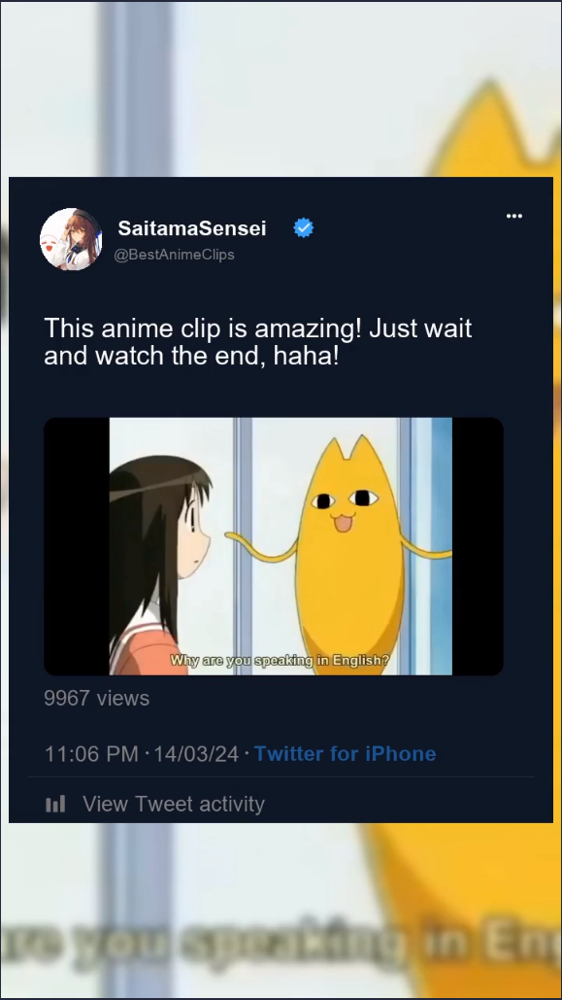

# ANITA: Anime Tiktok Automation

ANITA (Anime Tiktok Automation) is a Python project that allows you to create TikTok-style videos from anime clips. Uploading a single video file per clip. Whether you’re an anime enthusiast, a content creator, or just curious, ANITA was created mainly to experiment with video manipulation (via Moviepy).

{width=200px}

## Features
- Single Video Input: ANITA takes a single video file as input, and recreates the iconic re-uploaded social media format.
- 720P only, due to exponentially low rendering performance.
- Twitter template ontop of blurred video.
- Unfortunately there isn't much to show.

## Usage:
### Installation:
1. Clone this repository to your local machine. 
2. Install the required Python libraries using 
`pip install opencv-python`
`pip install moviepy`.
`pip install scipy`.
`pip install termcolor`. (not necessary for functionality)

### Prepare Your Video:
Place your anime video file (e.g., `video.mp4`) in the project directory.

### Run ANITA:
1. Open a terminal and navigate to the project directory.
2. Run `python main.py`.

### Output:
ANITA will process the video and create a new file called `video-with-overlay.mp4`.
You can find the generated TikTok-style video in the project directory after Moviepy has finished rendering the video. You can also find some remaining files left over which can be safely deleted after use.
- You can delete everything in the `temp`  directory

## Disclaimer!
ANITA is a learning project and not actively maintained. Feel free to fork the project, experiment with the code, and explore the world of video manipulation!

This has already taken me too long (from time of conception), and I don't have the time or energy to maintain or develop this project further. However, if you are interested in seeing this project through, check out the roadmap below. Hopefully you will find that I have written semantic code, but this might not be the case. I will try to create comments for code where possible and hopefully it will help you understand.

# Roadmap
- AI integration to pull clips, generate short descriptions, and generate fake usernames
- Multiple social media templates
- Friendly User interface
- Automatically upload after render
- Friendly user customisations to script variables, (e.g. resolution, frame rate and audio)
- Stop writing useless code

``Made with 💖 by Eggwite``
##### Please heart the project if you read this far. ✨

